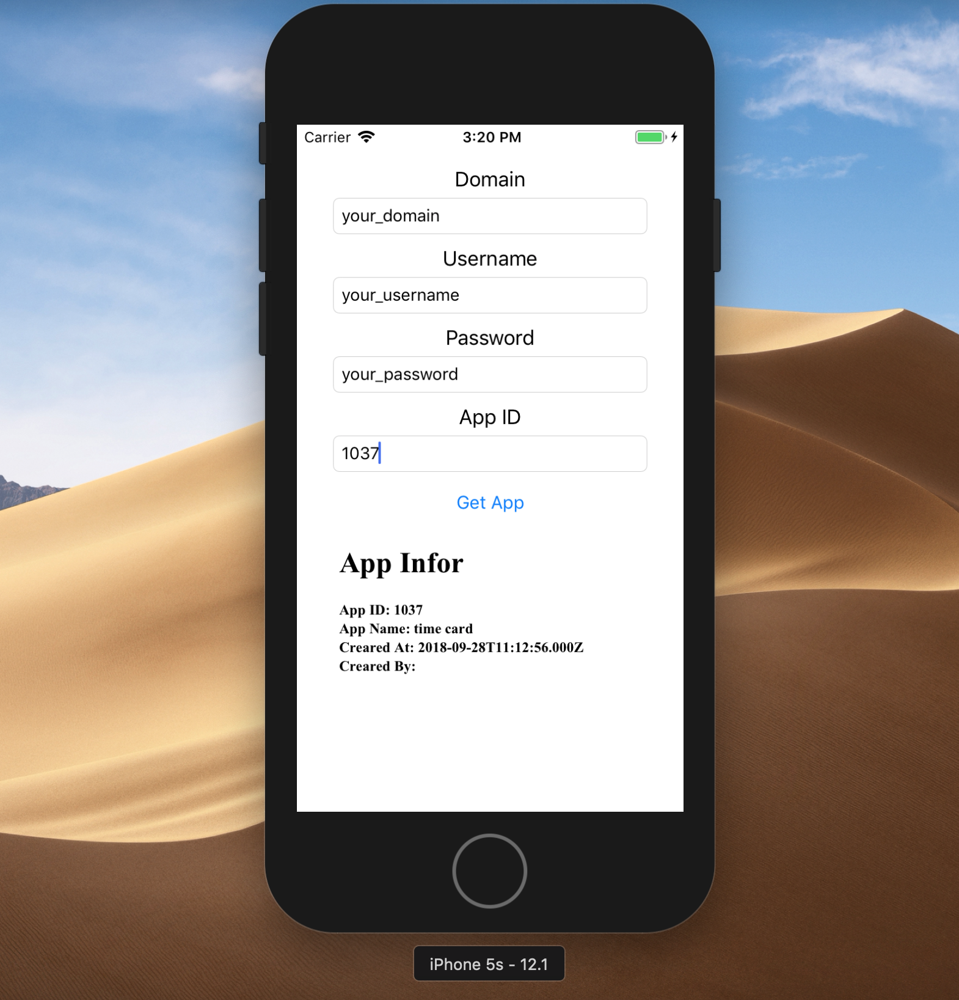

# Quickstart

## Requirement

* [kintone-ios-sdk](https://github.com/kintone/kintone-ios-sdk)
* [promises](https://github.com/google/promises)

## Following below steps

### Create a new project

### Install kintone iOS SDK packages
#### Install SDK by Carthage
* Get Carthage by running the bellow command or choose [another installation method](https://github.com/Carthage/Carthage#installing-carthage)

        brew install carthage

* Create [Cartfile](https://github.com/Carthage/Carthage/blob/master/Documentation/Artifacts.md#cartfile) into the ./testSDK folder 

        github "google/promises"
        github "kintone/kintone-ios-sdk"

* Run

        carthage update

* On your application targets’ General settings tab, in the Embedded Binaries section, add Item

        FBLPromises.framework
        Promises.framework
        kintone_ios_sdk.framework

#### Install SDK by Cocoapods
* Get Cocoapods by running the bellow command or choose [another installation method](https://guides.cocoapods.org/using/getting-started.html#getting-started)

        sudo gem install cocoapods

* Create [Podfile](https://guides.cocoapods.org/syntax/podfile.html) by command line in sample application folder

        pod init

* Add depedency packages into Podfile
        
        vi Podfile

* Modify Podfile

        target 'QuickStartApp' do
            use_frameworks!
            pod 'PromisesSwift'
            pod 'kintone-ios-sdk'
        # Pods for QuickStartApp
        end

* Run

        pod install

* On your application folder, click on *QuickStartApp.xcworkspace* file to start implementing sample

### Implement sample application using kintone iOS SDK

* Build the UI elements

* Connect the UI elements

* Open the ViewController.swift
    * Declare framework

            import UIKit
            import kintone_ios_sdk
            import Promises

    * Init SDK module

            let auth:Auth = Auth()
            var conn:Connection? = nil
            var app:App? = nil

    * Get attribute string

            func getAttributedString(_ htmlString: String) -> NSAttributedString {
                let htmlData = NSString(string: htmlString).data(using: String.Encoding.unicode.rawValue)
                let options = [NSAttributedString.DocumentReadingOptionKey.documentType: NSAttributedString.DocumentType.html]
                let attributedString = try! NSAttributedString(data: htmlData!, options: options, documentAttributes: nil)
                return attributedString
            }

    * Implement *getApp* function

            auth.setPasswordAuth(txtUserName.text!, txtPassword.text!)
            conn = Connection(txtDomain.text!, auth)
            print("domain \(txtDomain.text!)")
            app = App(conn)

            self.app?.getApp(Int(txtAppID.text!)!).then{ response in
                let htmlString = "<html>" +
                    "<head></head>" +
                    "<body><h1>App Infor</h1>" +
                    "<b>App ID: \(response.getAppId()!)</b> " +
                    "<b>App Name: \(response.getName()!)</b> " +
                    "<b>Creared At: \(response.getCreadtedAt()!)</b> " +
                    "<b>Creared By: \(response.getCreator()!.getName()!)</b> " +
                    "</body></head></html>"

                DispatchQueue.main.async {
                    self.txtResult.attributedText = self.getAttributedString(htmlString)
                }
            }.catch { error in
                var htmlString = "<html><head></head><body><h1>Error occur</h1>"

                if type(of: error) == KintoneAPIException.self
                {
                    let err = error as! KintoneAPIException
                    htmlString += "<b>Status code: \(err.getHttpErrorCode()!)</b>" +
                                    "
<b>Message: \(err.getErrorResponse()!.getMessage()!)</b>
"
                } else {
                    htmlString += "
<b>Message: \(error.localizedDescription)</b>
"
                }

                htmlString += "</body></head></html>"

                DispatchQueue.main.async {
                    self.txtResult.attributedText = self.getAttributedString(htmlString)
                }
            }

    * Validate input value from user

    
            func isFieldsValid() -> (Bool, String) {
        
            var errorString: String = ""
            var isValid: Bool = true
            if(txtDomain.text!.isEmpty)
            {
                isValid = false
                errorString = "Please input domain field"
                return (isValid, errorString)
            }
            if(txtUserName.text!.isEmpty)
            {
                isValid = false
                errorString = "Please input username field"
                return (isValid, errorString)
            }
            if(txtPassword.text!.isEmpty)
            {
                isValid = false
                errorString = "Please input Password field"
                return (isValid, errorString)
            }
            if(txtAppID.text!.isEmpty)
            {
                isValid = false
                errorString = "Please input app ID field"
                return (isValid, errorString)
            }
            return (isValid, "")
    }
    
    
* Set the promises of dispatch queue to global in the AppDelegate.swift. (Reference: [Default dispatch queue](https://github.com/google/promises/blob/master/g3doc/index.md#default-dispatch-queue) )

* FullCode
    * ViewController Class

            import UIKit
            import kintone_ios_sdk
            import Promises
            class ViewController: UIViewController {

                @IBOutlet weak var txtDomain: UITextField!
                @IBOutlet weak var txtPassword: UITextField!
                @IBOutlet weak var txtUserName: UITextField!
                @IBOutlet weak var txtAppID: UITextField!
                @IBOutlet weak var txtResult: UITextView!
                
                let auth:Auth = Auth.init()
                var conn:Connection? = nil
                var app:App? = nil
                override func viewDidLoad() {
                    super.viewDidLoad()
                    // Do any additional setup after loading the view, typically from a nib.
                    
                }

                @IBAction func getApp(_ sender: Any) {
                    let (isValid, errorString) = self.isFieldsValid()
                    if(!isValid){
                        DispatchQueue.main.async {
                            self.txtResult.attributedText = self.getAttributedString(errorString)
                        }
                        return
                    }
                    auth.setPasswordAuth(txtUserName.text!, txtPassword.text!)
                    conn = Connection(txtDomain.text!, auth)
                    app = App(conn)
                    
                    self.app?.getApp(Int(txtAppID.text!)!).then{ response in
                        let htmlString = "<html>" +
                            "<head></head>" +
                            "<body><h1>App Infor</h1>" +
                            "<b>App ID: \(response.getAppId()!)</b> " +
                            "<b>App Name: \(response.getName()!)</b> " +
                            "<b>Creared At: \(response.getCreadtedAt()!)</b> " +
                            "<b>Creared By: \(response.getCreator()!.getName()!)</b> " +
                            "</body></head></html>"
                        
                        DispatchQueue.main.async {
                            self.txtResult.attributedText = self.getAttributedString(htmlString)
                        }
                    }.catch { error in
                        var htmlString = "<html><head></head><body><h1>Error occur</h1>"
                        
                        if type(of: error) == KintoneAPIException.self
                        {
                            let err = error as! KintoneAPIException
                            htmlString += "<b>Status code: \(err.getHttpErrorCode()!)</b>" +
                                        "
<b>Message: \(err.getErrorResponse()!.getMessage()!)</b>
"
                        } else {
                            htmlString += "
<b>Message: \(error.localizedDescription)</b>
"
                        }
                        
                        htmlString += "</body></head></html>"
                        
                        DispatchQueue.main.async {
                            self.txtResult.attributedText = self.getAttributedString(htmlString)
                        }
                    }
                }
                
                func getAttributedString(_ htmlString: String) -> NSAttributedString {
                    let htmlData = NSString(string: htmlString).data(using: String.Encoding.unicode.rawValue)
                    let options = [NSAttributedString.DocumentReadingOptionKey.documentType: NSAttributedString.DocumentType.html]
                    let attributedString = try! NSAttributedString(data: htmlData!, options: options, documentAttributes: nil)
                    return attributedString
                }
                
            }

## Run The App
Build and run the iOS App.

After inserting the domain data, credentials and the target Kintone App ID, click on the Get App button.

The iOS App should retrieve the infomation of the specified Kintone App, and display it in the text view.

